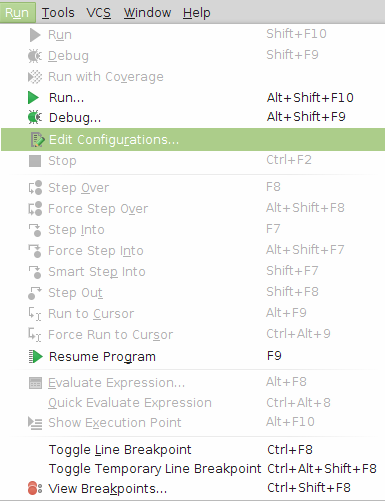
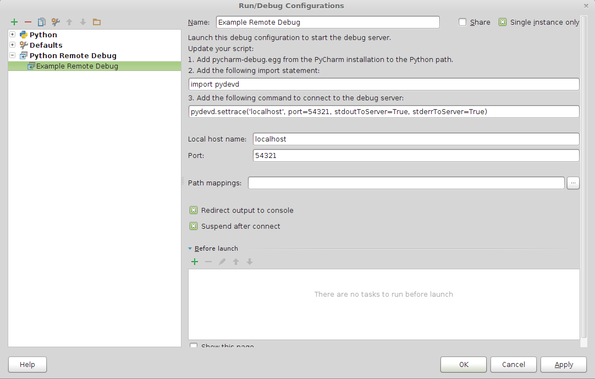
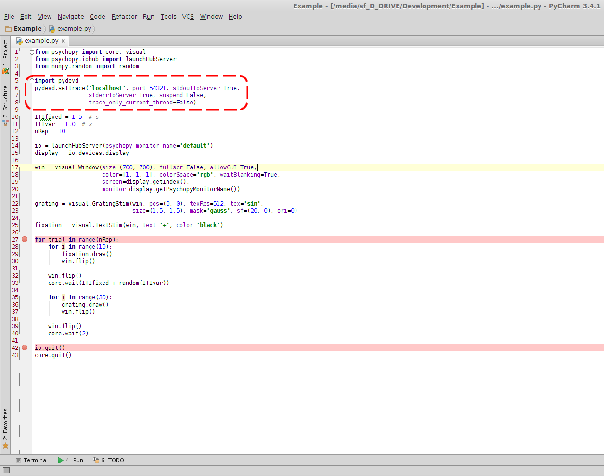
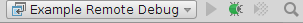
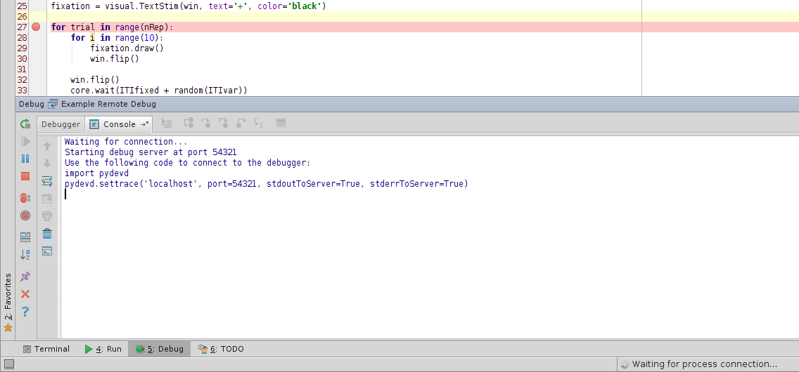
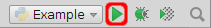
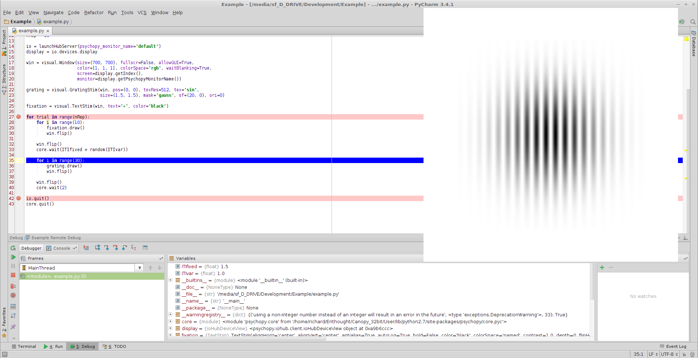

=========================================
Using PyCharm to Debug ioHub and Psychopy
=========================================

Uninstall PyDev
===============
If you already have ``PyDev`` installed, you should probably uninstall it
first. If ``PyDev`` is not installed, you can skip this step.

To uninstall ``PyDev``, either use your Python distribution's package
manager, run ``pip uninstall pydev`` from a terminal, or manually remove
the ``pydev`` subdirectory from your ``site-packages``.

Install PyCharm's PyDev Fork
============================
Open a terminal and navigate to your PyCharm installation diretory. It
should contain a file named ``pycharm-debug.egg``. Install it using
``egginst`` by typing

    ``egginst pycharm-debug.egg``

``PyDev`` should now be available in your Python environment.

Add Remote Debugger to PyCharm
==============================
Open your project in ``PyCharm`` and click on
``Run / Edit Configurations...``.

Click on the green ``+`` sign and select ``Python Remote Debug``.

.. image:: images/02 - Add New Configuration.png

Give a descriptive name to the remote debug configuration, like
``MyProject Remote Debug``. Set the port number the debugger should bind to
(``54321`` will usually do). You should probably also tick the
``Single instance only`` checkbox.

Prepare Your Code and Add Breakpoints
=====================================
Add the following code at the beginning of the program you wish to debug:

.. code-block:: python
    import pydevd

    pydevd.settrace('localhost', port=54321, stdoutToServer=True,
                    stderrToServer=True, suspend=False,
                    trace_only_current_thread=False)

When this code is run, it will try to connect to the remote debugger, which
is supposed to run on ``localhost:54321``. *Do not run it yet!*

You may add breakpoints to your project. This can be done visually by
left-clicking left of the lines at which you wish to halt execution.

Start the Remote Debugger
=========================
Select the remote debugger configuration created earlier, and click on the
debug button to run it.

The debug server will start and wait for a client to connect.

Run And Debug Your Project
==========================
Select the run configuration for your project and click the **play** button
to run it. *Do not click the debug button!*

The debugger will connect, and your code will be executed until it reaches
the first breakpoint.

You may now step through your code and all functions
it invokes, watch variables, or open a debug console for immediate pythonic
interaction!
